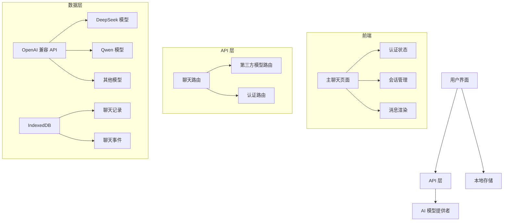

# 项目 Code Wiki

## 1. 项目概览

这是一个基于 Next.js 16 和 React 19 的 AI 聊天应用，使用 Vercel AI SDK 提供智能对话功能。项目支持多种 AI 模型，包括 DeepSeek、Qwen、Kimi 和 GLM 等，提供了流畅的聊天体验和会话管理功能。

**主要功能：**
- AI 聊天对话（支持多种模型）
- 会话管理（创建、切换、删除）
- 用户认证系统
- 本地消息存储
- 响应式设计（支持桌面和移动设备）
- 动画效果

## 2. 项目架构

项目采用现代化的 Next.js 16 架构，结合 React 19 的新特性，使用 TypeScript 确保类型安全。整体架构分为前端界面、API 层和数据层三个主要部分。

### 2.1 架构图



## 3. 核心模块

### 3.1 AI 模型提供者

**模块职责**：配置和管理 AI 模型的访问，提供统一的接口来调用不同的模型。

**关键文件**：
- [lib/ai-provider.ts](file:///workspace/lib/ai-provider.ts)

**核心功能**：
- 创建 OpenAI 兼容的提供者实例
- 支持自定义 API 密钥和基础 URL
- 提供获取第三方模型的方法

**使用示例**：
```typescript
// 获取指定模型
const model = getThirdPartyModel('deepseek-chat');

// 用于流式文本生成
const result = streamText({
  model,
  messages: messages
});
```

### 3.2 模型配置

**模块职责**：定义和管理可用的 AI 模型配置。

**关键文件**：
- [lib/model-config.ts](file:///workspace/lib/model-config.ts)

**核心功能**：
- 定义模型配置接口
- 提供可用模型列表
- 包含模型的名称、类型、提供者和模式等信息

### 3.3 本地存储

**模块职责**：使用 IndexedDB 存储聊天记录和事件，实现本地持久化。

**关键文件**：
- [lib/db.ts](file:///workspace/lib/db.ts)

**核心功能**：
- 初始化数据库
- 保存和获取聊天记录
- 添加聊天事件
- 管理聊天历史

### 3.4 API 路由

**模块职责**：处理 API 请求，与 AI 模型进行交互。

**关键文件**：
- [app/api/chat/route.ts](file:///workspace/app/api/chat/route.ts)
- [app/api/third-party/route.ts](file:///workspace/app/api/third-party/route.ts)

**核心功能**：
- 处理聊天请求
- 验证用户权限
- 调用 AI 模型生成响应
- 流式返回结果

### 3.5 主聊天界面

**模块职责**：提供用户友好的聊天界面，处理用户交互和消息显示。

**关键文件**：
- [app/page.tsx](file:///workspace/app/page.tsx)

**核心功能**：
- 聊天消息显示和输入
- 会话管理（创建、切换、删除）
- 模型选择
- 动画效果
- 响应式布局

## 4. Vercel AI SDK 使用

### 4.1 核心功能

Vercel AI SDK 在项目中用于实现智能对话功能，主要使用以下核心功能：

1. **useChat Hook**：管理聊天状态和消息流
   - 提供 `messages`、`sendMessage` 等状态和方法
   - 支持自定义传输配置

2. **streamText**：流式文本生成
   - 从 AI 模型获取流式响应
   - 支持系统提示、温度等参数

3. **convertToModelMessages**：消息格式转换
   - 将 UI 消息转换为模型可理解的格式

4. **DefaultChatTransport**：自定义传输
   - 配置 API 端点和请求参数

### 4.2 使用示例

#### 前端使用

```typescript
// 导入必要的模块
import { useChat } from '@ai-sdk/react';
import { DefaultChatTransport } from 'ai';

// 配置传输
const transport = React.useMemo(() => new DefaultChatTransport({ 
  api: '/api/third-party',
  body: { model: selectedModel }
}), [selectedModel]);

// 使用 useChat hook
const { messages, setMessages, sendMessage, status, error } = useChat({
  transport,
  id: currentChatId,
  onFinish: ({ messages: newMessages }) => {
    // 处理完成后的逻辑
  }
});

// 发送消息
sendMessage({ text: input });
```

#### 后端使用

```typescript
// 导入必要的模块
import { convertToModelMessages, streamText, type UIMessage } from 'ai';

// 处理 POST 请求
export async function POST(req: Request) {
  const { messages }: { messages: UIMessage[] } = await req.json();

  // 调用 AI 模型
  const result = streamText({
    model: getThirdPartyModel(modelName),
    messages: await convertToModelMessages(messages),
    system: systemPrompt,
    temperature: typeof body?.temperature === 'number' ? body.temperature : undefined,
  });

  // 返回流式响应
  return result.toUIMessageStreamResponse();
}
```

## 5. 关键类与函数

### 5.1 getThirdPartyModel

**功能**：获取第三方 AI 模型实例

**参数**：
- `modelName` (可选)：模型名称

**返回值**：AI 模型实例

**使用场景**：在 API 路由中用于获取指定的 AI 模型

### 5.2 useChat

**功能**：管理聊天状态和消息流

**参数**：
- `transport`：自定义传输配置
- `id`：聊天会话 ID
- `onFinish`：完成回调

**返回值**：包含 `messages`、`sendMessage` 等状态和方法的对象

**使用场景**：在前端组件中用于管理聊天功能

### 5.3 streamText

**功能**：流式文本生成

**参数**：
- `model`：AI 模型实例
- `messages`：消息数组
- `system`：系统提示
- `temperature`：温度参数
- `maxOutputTokens`：最大输出 token 数
- `topP`：top-p 参数

**返回值**：流式响应对象

**使用场景**：在 API 路由中用于从 AI 模型获取流式响应

### 5.4 saveChat

**功能**：保存聊天记录到本地存储

**参数**：
- `id`：聊天 ID
- `title`：聊天标题
- `messages`：消息数组

**使用场景**：在聊天完成后保存聊天记录

### 5.5 loadSidebar

**功能**：加载侧边栏聊天列表

**使用场景**：在组件挂载或聊天更新后加载聊天历史

## 6. 依赖关系

| 依赖 | 版本 | 用途 |
|------|------|------|
| @ai-sdk/deepseek | ^2.0.29 | DeepSeek 模型集成 |
| @ai-sdk/openai | ^3.0.52 | OpenAI 兼容 API 集成 |
| @ai-sdk/react | ^3.0.160 | React 集成 |
| ai | ^6.0.158 | Vercel AI SDK 核心 |
| next | 16.2.2 | Next.js 框架 |
| react | 19.2.4 | React 库 |
| zustand | ^5.0.12 | 状态管理 |
| idb | ^8.0.3 | IndexedDB 封装 |
| gsap | ^3.14.2 | 动画库 |
| tailwindcss | ^4 | CSS 框架 |

## 7. 项目运行

### 7.1 环境变量

项目需要以下环境变量：

- `THIRD_PARTY_API_KEY` 或 `OPENAI_API_KEY`：AI 模型 API 密钥
- `THIRD_PARTY_BASE_URL` 或 `BASE_URL`：API 基础 URL（可选）
- `THIRD_PARTY_MODEL`：默认模型名称（可选）
- `THIRD_PARTY_SYSTEM_PROMPT`：系统提示（可选）

### 7.2 安装依赖

```bash
# 使用 pnpm
pnpm install

# 或使用 bun
bun install
```

### 7.3 启动开发服务器

```bash
# 使用 pnpm
pnpm dev

# 或使用 bun
bun dev
```

### 7.4 构建项目

```bash
# 使用 pnpm
pnpm build

# 或使用 bun
bun run build
```

### 7.5 启动生产服务器

```bash
# 使用 pnpm
pnpm start

# 或使用 bun
bun run start
```

## 8. 项目结构

```
├── app/
│   ├── api/
│   │   ├── auth/          # 认证相关 API
│   │   ├── chat/          # 聊天 API
│   │   └── third-party/   # 第三方模型 API
│   ├── components/        # 组件
│   ├── login/             # 登录页面
│   ├── layout.tsx         # 布局
│   └── page.tsx           # 主聊天页面
├── lib/
│   ├── ai-provider.ts     # AI 模型提供者
│   ├── db.ts              # 本地存储
│   ├── model-config.ts    # 模型配置
│   └── utils.ts           # 工具函数
├── store/
│   └── auth.ts            # 认证状态管理
├── public/                # 静态资源
├── package.json           # 项目配置
└── tsconfig.json          # TypeScript 配置
```

## 9. 认证系统

项目实现了简单的认证系统，包括：

- 登录页面：`app/login/page.tsx`
- 认证状态管理：`store/auth.ts`
- 认证 API：`app/api/auth/route.ts`

**认证流程**：
1. 用户登录获取 token
2. token 存储在 cookie 中
3. API 请求时验证 token
4. 登出时清除 token

## 10. 消息处理

### 10.1 消息格式

项目使用 Vercel AI SDK 的 `UIMessage` 格式，包含以下字段：
- `id`：消息 ID
- `role`：角色（user、assistant、system）
- `content`：消息内容
- `parts`：消息部分（可选）

### 10.2 消息存储

消息存储在 IndexedDB 中，使用以下结构：
- `chats`：聊天记录
- `chatEvents`：聊天事件

### 10.3 消息渲染

消息渲染支持 Markdown 格式，使用 `react-markdown` 库进行渲染，支持：
- 基本 Markdown 语法
- GitHub 风格的 Markdown
- 安全的 HTML 渲染

## 11. 模型选择

项目支持多种 AI 模型，包括：

- DeepSeek 系列
- Qwen 系列
- Kimi 系列
- GLM 系列

用户可以在聊天界面中选择不同的模型，系统会根据选择的模型调用相应的 API。

## 12. 性能优化

### 12.1 流式响应

使用 Vercel AI SDK 的流式响应功能，实现实时生成效果，提升用户体验。

### 12.2 本地存储

使用 IndexedDB 进行本地存储，减少网络请求，提升应用响应速度。

### 12.3 动画效果

使用 GSAP 库实现流畅的动画效果，提升用户体验。

## 13. 安全性

### 13.1 API 保护

API 路由实现了简单的认证检查，确保只有授权用户能够访问。

### 13.2 输入验证

对 API 请求进行输入验证，确保请求格式正确。

### 13.3 错误处理

实现了错误处理机制，确保 API 请求失败时能够返回适当的错误信息。

## 14. 未来扩展

### 14.1 功能扩展

- 支持更多 AI 模型
- 实现消息历史搜索
- 添加文件上传功能
- 支持多语言

### 14.2 性能优化

- 实现消息缓存
- 优化模型调用
- 提升动画性能

### 14.3 安全性增强

- 实现更复杂的认证系统
- 添加 API  rate limiting
- 增强输入验证

## 15. 总结

本项目是一个功能完整的 AI 聊天应用，使用 Vercel AI SDK 实现智能对话功能。项目采用现代化的技术栈，包括 Next.js 16、React 19、TypeScript 和 Tailwind CSS，提供了流畅的用户体验和丰富的功能。

Vercel AI SDK 的使用是项目的核心，它提供了简单而强大的接口来与 AI 模型进行交互，实现了流式响应、消息管理等功能。项目的架构清晰，代码组织合理，为未来的扩展和维护提供了良好的基础。